> **ASSIGNMENT-2**
>
> **Part-I**
>
> **Representation Learning with Autoencoders and Denoising
> Autoencoders.**
>
> **Dataset: CIFAR-10**

- The dataset consists of 60,000 color images (32x32 pixels) from 10
  classes, with 50,000 training images and 10,000 test images.

- Each image is an RGB image with 3 channels.

> **Model-1: Standard Autoencoder (AE)**
>
> You are required to build a standard Autoencoder (AE) to learn
> meaningful representations from the
>
> CIFAR-10 dataset.

1.  The encoder should consist of convolutional layers for feature
    extraction.

2.  The decoder should use transpose convolutions (ConvTranspose2D) to
    reconstruct images.

3.  Train the model using Mean Squared Error (MSE) loss.

> **Task:**

1.  Train the AE on CIFAR-10 and evaluate reconstruction quality on test
    data(using SSIM,PSNR, MAE, MSE).

2.  Visualize latent space representations using t-SNE or PCA.

<!-- -->

1.  **[Visualize original vs. reconstructed images.]{.underline}**

> 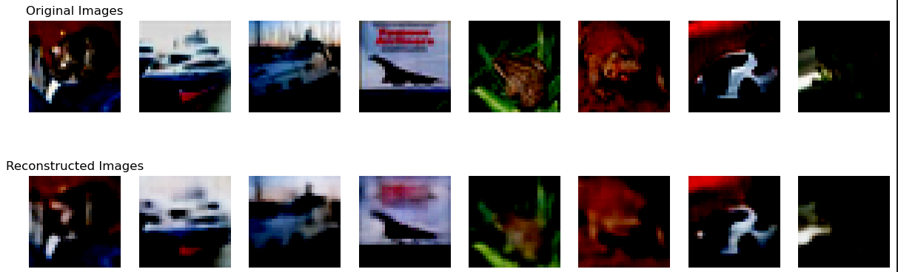{width="7.526482939632546in"
> height="3.0201049868766403in"}
>
> **Fig:1**

2.  **[Plot average error (y-axis) vs. epochs (x-axis).]{.underline}**

> 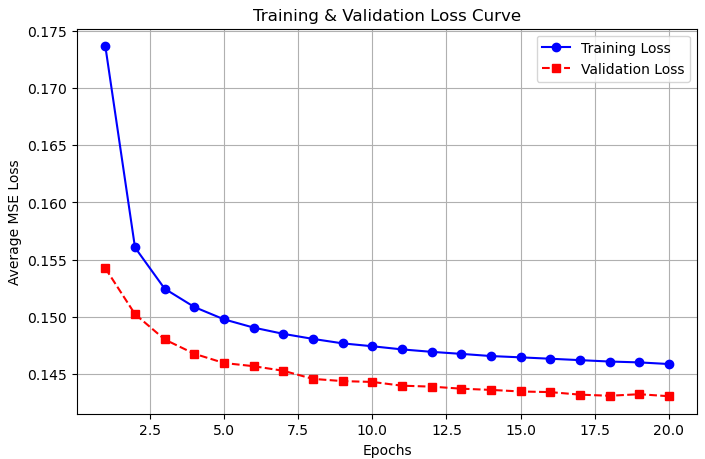{width="5.611536526684165in"
> height="3.6439851268591426in"}
>
> **Fig:2**

3.  **[Compare latent space structure for clean vs. noisy input
    images.]{.underline}**

> 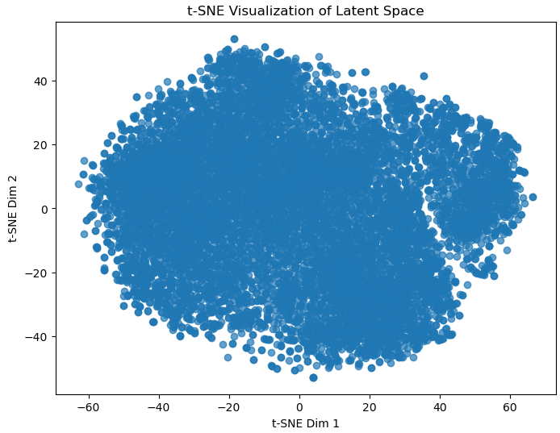{width="4.822916666666667in"
> height="3.706030183727034in"}

**Fig:3**

4.  **[Discuss the effectiveness of autoencoders in feature
    learning]{.underline}**

> Autoencoders learn to compress input data into a latent representation
> (encoding) that captures the most **salient features** of the input
> distribution. The encoder learned low-dimensional abstractions of
> input images. Despite being trained to reconstruct, the latent
> features preserve class-specific structure, as seen in t-SNE/PCA plots
> visualized in Fig:3.

### **Quantitative Evaluation**

> The AE was evaluated on test images using common image quality
> metrics. Our evaluation Results include
>
> \'SSIM\': 0.23389441,
>
> \'PSNR\': 8.938674363215792
>
> \'MAE\': 0.28560546
>
> \'MSE\': 0.15566076

#### **Reconstructed Images:** Reconstructed outputs retained overall shape and dominant colors, but lacked fine textures and edge clarity. Images appear blurred, which is typical of AEs optimized with pixel-wise loss.

#### **Latent Space (t-SNE / PCA)** Latent representations formed loosely clustered structures corresponding to classes. Thus we conclude that the encoder captures semantically useful features even if reconstruction is weak.

### **Clean vs. Noisy Latent Representations :** When input images were corrupted with moderate noise the latent clusters were slightly disturbed, but still preserved structural grouping. This concludes that the AE has some generalization and denoising capacity, though not designed for noise robustness.

> The trained autoencoder exhibited effective feature abstraction in the
> latent space (as shown by clustering). Limited reconstruction quality,
> as seen from low SSIM and PSNR scores.Sensitivity to noise, but latent
> features remained informative.Despite modest reconstruction metrics
> (SSIM: 0.23, PSNR: 8.94 dB), the autoencoder successfully learned
> compressed, semantically meaningful features from CIFAR-10 data. These
> features can serve as inputs to downstream tasks such as
> classification or anomaly detection.
>
> **Model-2: Denoising Autoencoder (DAE)**
>
> A Denoising Autoencoder (DAE) is trained to reconstruct original
> images from corrupted versions.
>
> ● Apply Gaussian noise (mean=0, variance=0.1) to input images before
> feeding them into the encoder.
>
> ● The architecture remains the same as AE, but the model learns to
> remove noise instead
>
> of just reconstructing inputs.

**Presentation of Results:**

1.  **[Visualize original, noisy, and reconstructed
    images.]{.underline}**

> 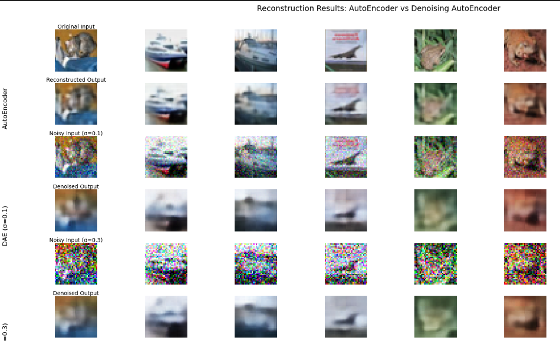{width="7.192020997375328in"
> height="3.86956583552056in"}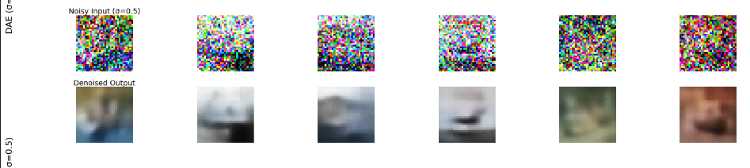{width="7.2162073490813645in"
> height="1.6381003937007874in"}
>
> **Fig:4**

2.  **[Plot the average error vs. epochs for both AE and
    DAE.]{.underline}**

> 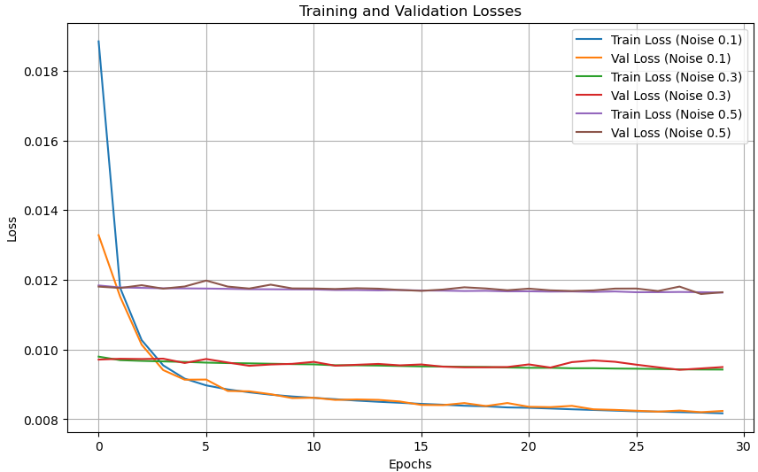{width="6.036458880139983in"
> height="3.7604166666666665in"}
>
> **Fig:5**

3.  **[Compare feature extraction quality between AE and DAE using a
    classifier trained on their latent representations.]{.underline}**

> AE learns effective features from clean data, but its latent
> representations degrade significantly under noise. DAE generalizes
> better to noisy conditions due to its exposure to noise during
> training. Latent representations from DAE are more robust and
> class-discriminative under various noise levels. DAEs outperform AEs
> in terms of feature robustness and generalization. When trained on
> noisy data, DAEs can learn stable and meaningful latent features that
> maintain class separability even in noisy environments.

4.  **[Discuss when AE vs. DAE is preferable for feature
    learning.]{.underline}**

> Based on above results we can conclude that AE, DAE works better in
> which conditions.

+--------------+--------------+---------------------------------------+
| *            | >            | > **Reason**                          |
| *Condition** |  **Preferred |                                       |
|              | > Model**    |                                       |
+==============+==============+=======================================+
| > **Clean    | > AE         | > AEs perform well when data is       |
| > and        |              | > noise-free and consistent. They     |
| > structured |              | > learn compact representations       |
| > data**     |              | > without needing to account for      |
|              |              | > corruption.                         |
+--------------+--------------+---------------------------------------+
| > **Data     | > DAE        | > DAEs are trained to handle noisy    |
| > with       |              | > inputs and learn representations    |
| > noise,     |              | > that ignore irrelevant variations.  |
| >            |              |                                       |
|  corruption, |              |                                       |
| > or         |              |                                       |
| >            |              |                                       |
|  artifacts** |              |                                       |
+--------------+--------------+---------------------------------------+
| >            | > DAE        | > In real-world applications (e.g.,   |
| **Robustness |              | > sensor noise, environmental         |
| > to         |              | > variability), DAEs provide more     |
| > real-world |              | > stable and generalizable features.  |
| > v          |              |                                       |
| ariability** |              |                                       |
+--------------+--------------+---------------------------------------+
| > **Anomaly  | > DAE        | > Since DAEs learn to reconstruct     |
| > or novelty |              | > clean data, they highlight          |
| >            |              | > deviations (anomalies) when inputs  |
|  detection** |              | > differ from learned patterns.       |
+--------------+--------------+---------------------------------------+
| >            | > AE         | > If the goal is dimensionality       |
| **Compressed |              | > reduction (like PCA), a basic AE is |
| > re         |              | > sufficient and more efficient.      |
| presentation |              |                                       |
| > learning** |              |                                       |
+--------------+--------------+---------------------------------------+
| > **Transfer | > DAE        | > DAEs typically produce more useful  |
| > learning   |              | > latent features for classification  |
| > or         |              | > or clustering due to their          |
| > downstream |              | > resilience to noise.                |
| > c          |              |                                       |
| lassifiers** |              |                                       |
+--------------+--------------+---------------------------------------+
| > **         | > AE         | > AEs are simpler and faster to train |
| Low-resource |              | > when noise handling is not          |
| >            |              | > required.                           |
| environments |              |                                       |
| > (speed &   |              |                                       |
| > s          |              |                                       |
| implicity)** |              |                                       |
+--------------+--------------+---------------------------------------+

> An autoencoder (AE) is ideal when the input data is clean and
> controlled. Denoising Autoencoder (DAE) is better when the input is
> noisy, imperfect, or subject to real-world corruption. DAEs are often
> a better default choice when data uncertainty is expected.

**PART-II**

1.  **[Visualize latent space interpolations and latent space
    arithmetic.]{.underline}**

> Below Fig 1 indicates latent space interpolation. Interpolating in
> latent space means linearly blending between two latent vectors and
> decoding each point back into image space. Fig 2 visualizes latent
> space arithmetic which involves manipulating latent codes like vectors
> on Dog - Cat + Bird images.
>
> 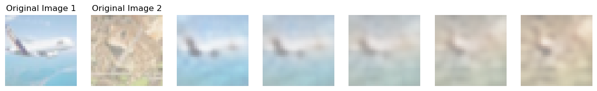{width="7.604166666666667in"
> height="1.6180686789151355in"}
>
> **Fig 1: Latent space interpolation**
>
> 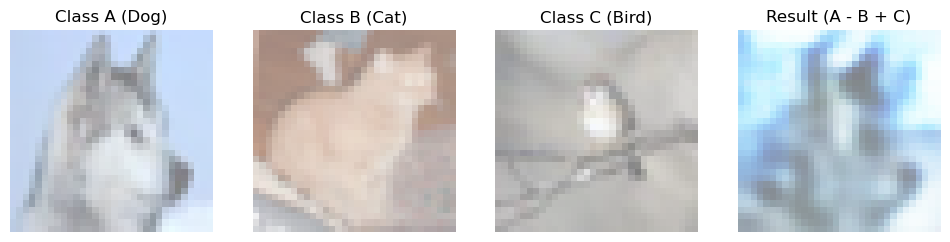{width="7.645833333333333in"
> height="1.6305391513560805in"}
>
> **Fig 2: Latent space arithmetic**

2.  **[Compare VAE vs. AE reconstructions.]{.underline}**

> 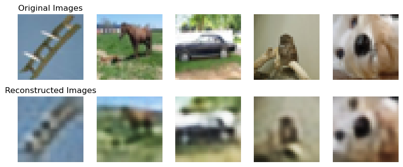{width="5.598958880139983in"
> height="2.3239260717410324in"}
>
> **Fig 3: VAE Reconstruction**
>
> 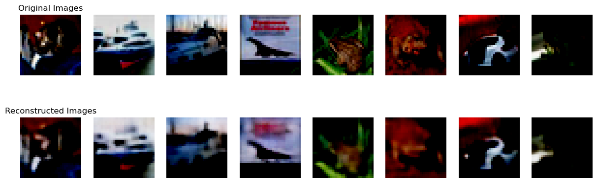{width="7.161458880139983in"
> height="2.2101924759405076in"}
>
> **Fig 4: AE Reconstruction**
>
> The AE reconstructions retain sharper edges and clear structure as in
> Fig: 4. Colors and textures are reasonably preserved. Reconstructed
> images can be seen less blurry, better at preserving fine details of
> the input image. VAE reconstructions are visibly blurrier than AE
> outputs. Reconstructed VaE images still preserve general shapes and
> color regions but lose fine-grained information. VaE outputs are
> visualized in Fig :3.

3.  **[Plot the KL-divergence loss and reconstruction loss over
    epochs.]{.underline}**

> 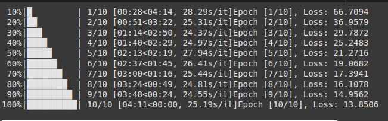{width="5.505208880139983in"
> height="1.7292005686789151in"}
>
> 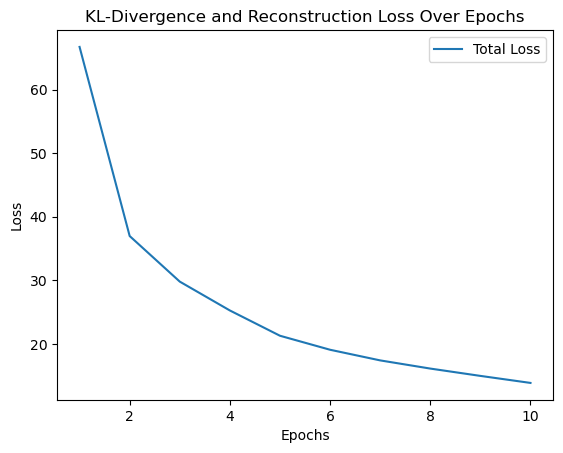{width="4.348958880139983in"
> height="3.4972036307961503in"}
>
> **Fig: 4 KL-divergence loss and reconstruction loss over 10 epochs**
>
> **4. P[rovide qualitative observations on latent space
> structure.]{.underline}**
>
> 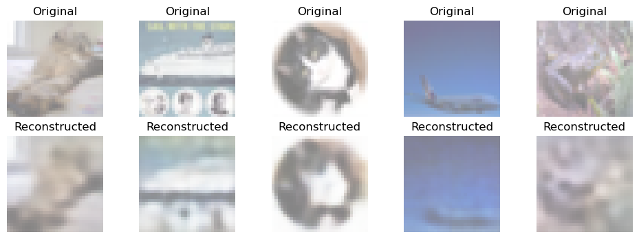{width="6.901042213473316in"
> height="2.4270833333333335in"}
>
> **Fig:5 Observations on latent space structure**
>
> The reconstructions visualized above in Fig:5 indicate that the VAE
> has learned a well-structured, smooth latent space where semantically
> similar images lie close together. Despite a trade-off in sharpness,
> the latent space enables meaningful compression and robust
> reconstruction of high-level features, suitable for generation and
> interpolation tasks.

**Part III**

**[Reconstruction quality between MCAE, AE, and VAE.]{.underline}**

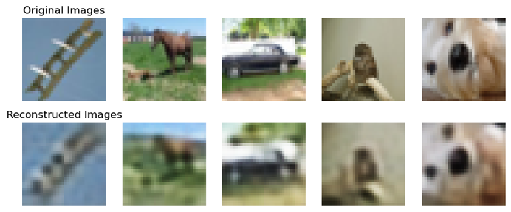{width="7.619792213473316in"
height="3.165575240594926in"}

**Fig. VAE Reconstruction**

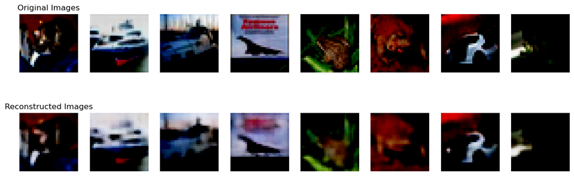{width="7.244792213473316in"
height="2.2284842519685037in"}

**Fig. AE Reconstruction**

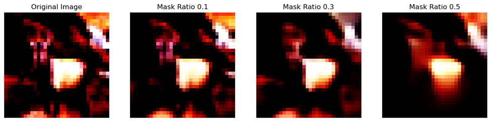{width="7.403852799650044in"
height="1.8402635608048994in"}

**Fig. MCAE Reconstruction**

**1. VAE**

- Reconstructed images are blurry and lack sharpness.

- VAEs optimize for both reconstruction and latent distribution
  regularization (KL divergence). This often leads to loss of detail due
  to the probabilistic sampling, resulting in smoother but less accurate
  outputs.

**2. AE**

- Reconstructed images are clearer and more detailed compared to VAE.

- AEs only minimize reconstruction loss, so they tend to retain more
  structure and finer details of the original image. However, they may
  overfit or not generalize well compared to VAEs.

**3. MCAE**

- With 0.1 mask ratio, reconstructions are quite good and close to the
  original.

- As the mask ratio increases, image quality gradually degrades, but the
  model still retains major features even at 0.5 mask ratio.

- MCAE is trained to reconstruct missing parts, promoting robustness. It
  learns context-aware representations, making it better at recovering
  corrupted or missing parts compared to traditional AE or VAE.

> **[Heatmaps showing which parts of an image are most important for
> reconstruction.]{.underline}**

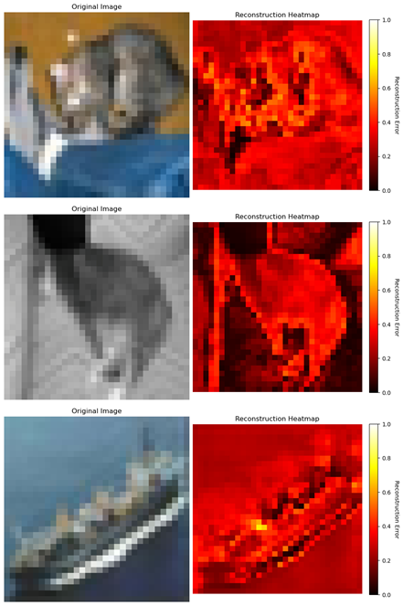{width="2.6927088801399823in"
height="3.9586832895888016in"}
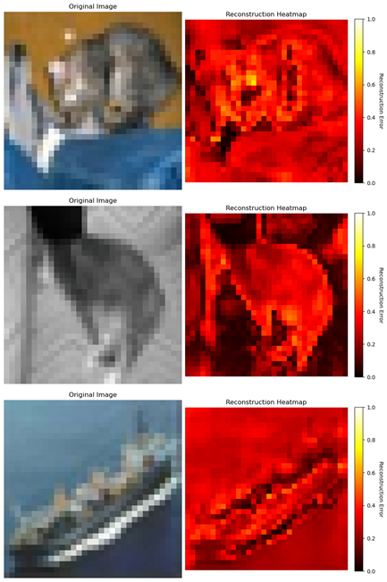{width="2.5593569553805775in"
height="3.8490332458442693in"}

**Fig. Mask ratio 0.1 Fig. Mask ratio 0.3**

> 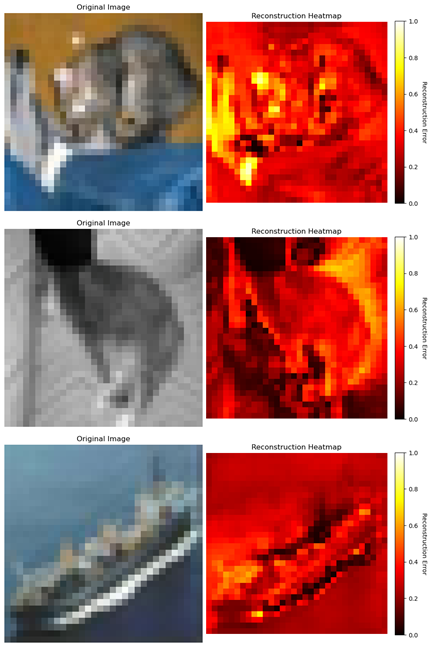{width="2.401042213473316in"
> height="3.6065857392825897in"}

**Fig. Mask ratio 0.5**

**Mask Ratio 0.1**

- Most regions are well reconstructed, especially the background and
  larger flat surfaces.

- At 10% masking, the model performs well --- only detailed/complex
  textures slightly degrade.

**Mask Ratio 0.3**

- Error intensity increases, especially on key object structures.

- The model starts struggling with more abstract reconstruction as it
  sees less of the original image, but still preserves the basic shape.

**Mask Ratio 0.5**

- Significant error over all key regions. Bright yellow patches appear
  more frequently.

- It loses fine details but still maintains rough shapes.

**[Observations on whether CNN-based masking retains global information
like ViTs.]{.underline}**

+----------------------+----------------------+-----------------------+
| **Aspect**           | **CNNs (like MCAE)** | **Vision Transformers |
|                      |                      | (ViTs)**              |
+======================+======================+=======================+
| **Receptive Field**  | Inherently limited   | Global                |
|                      | (Local)              | (self-attention       |
|                      |                      | across all patches)   |
+----------------------+----------------------+-----------------------+
| **Inductive Bias**   | Strong (translation  | Weak (learns          |
|                      | invariance,          | relations, no         |
|                      | locality)            | locality bias)        |
+----------------------+----------------------+-----------------------+
| **Masking Impact**   | High impact as       | Lower impact due to   |
|                      | masked regions is    | global aggregation    |
|                      | hard to infer from   |                       |
|                      | local context        |                       |
+----------------------+----------------------+-----------------------+
| **Global Awareness** | Built slowly via     | Present from the      |
|                      | deeper layers        | first attention layer |
|                      |                      |                       |
|                      |                      |   ------------------  |
|                      |                      |                       |
|                      |                      |   ------------------  |
+----------------------+----------------------+-----------------------+

- CNN-based masking (like MCAE) does not retain global information as
  effectively as ViTs.

- CNNs need deeper hierarchies to build global awareness, and struggle
  when large parts are missing.

- ViTs, by design, capture global context early, making them more robust
  for masked reconstruction tasks, especially at high mask ratios.
