# CS671: Deep Learning and Applications
## Assignment-1 Report
## PART-I: Classification Tasks

### Visualization of Train and Test Dataset for LS and NLS Classes

#### LS Dataset
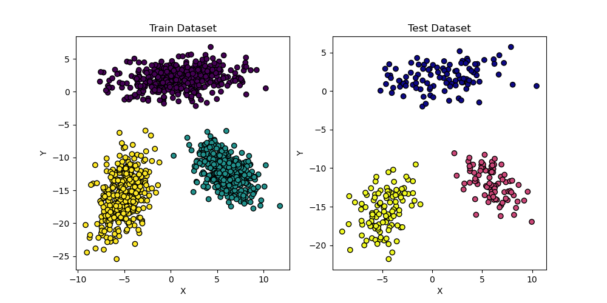

#### NLS Dataset
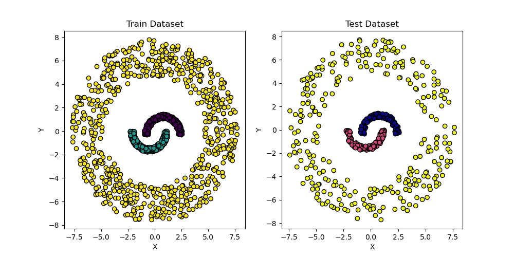

### Plot of Average Error vs. Epochs on Train Data

#### LS Dataset
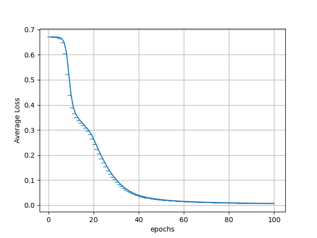

#### NLS Dataset
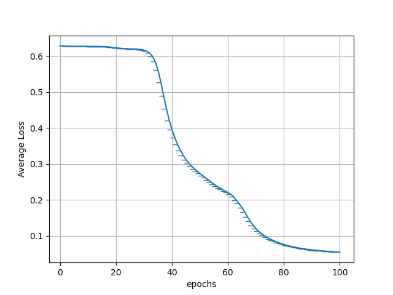

### Activation Function Used

The activation function is crucial for introducing non-linearity into the model, allowing it to learn complex relationships.

#### Activation Functions Used:

- **Sigmoid:**
$$\sigma(x) = \frac{1}{1 + e^{-x}}$$
  - Used in the hidden layers.
  - Maps input to (0,1).
  - Can suffer from vanishing gradients.

- **Softmax:**
  $$\sigma(x_i) = \frac{e^{x_i}}{\sum_{j} e^{x_j}} $$
  - Used for multi-class classification in the output layer.
  - Converts logits to probabilities.

### Decision Region for Each Dataset

#### LS Dataset

#### NLS Dataset
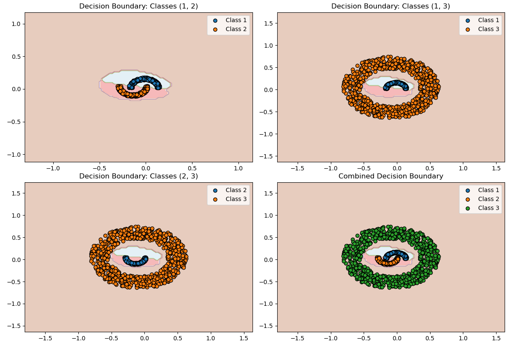

### Confusion Matrix and Accuracy

#### LS Dataset
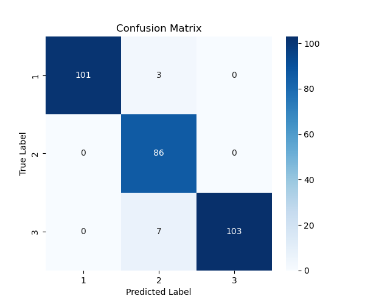

#### NLS Dataset
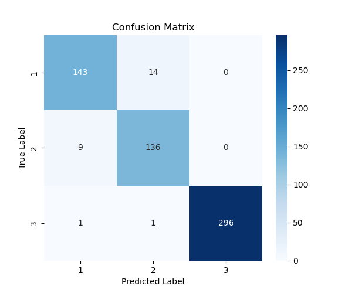

### Conclusion

- The dataset shows clear separability in LS cases but overlaps in NLS cases.
- The decision boundary in LS is more structured than NLS.
- Model performance can improve with better feature scaling and hyperparameter tuning.

---

## PART-II: Classification Tasks - Multi-Layer Perceptron and CNN

### Dataset Description

- **MNIST Dataset**
  - 60,000 training images, 10,000 test images.
  - Grayscale, 28×28 pixels.
  - Classes: Digits 0-9.

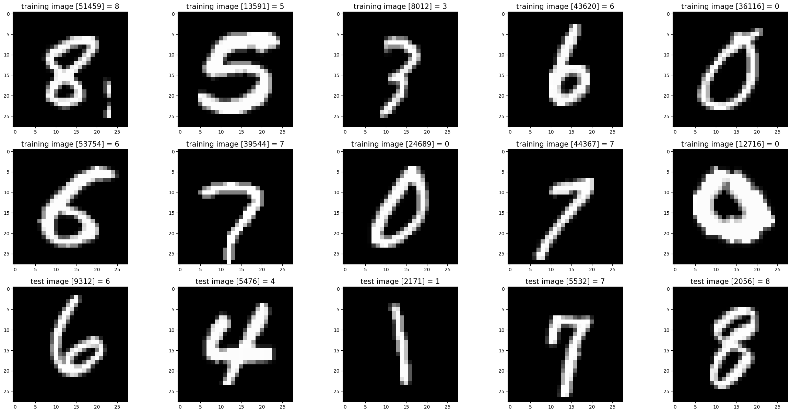

### Multi-Layer Perceptron (MLP) for Classification

#### Model Architecture

- **Input Layer:** 784-dimensional flattened vector.
- **Hidden Layer:** 128 neurons, ReLU activation.
- **Output Layer:** 10 neurons, Softmax activation.

#### Activation Functions

- **ReLU:**
  f(x) = $$\max(0, x) $$

- **Softmax:**
  $$\sigma(x_i) = \frac{e^{x_i}}{\sum_{j} e^{x_j}} $$

#### Training Method

- **Loss Function:** Categorical Cross-Entropy.
- **Optimization:** Gradient Descent with Momentum.
- **Learning Rate Scheduling:**
  $$\alpha_{epoch} = \frac{\alpha_0}{1 + \lambda \cdot epoch} $$

### CNN Model Architecture

- **Conv Layer 1:** 32 filters, 3×3 kernel, padding=1.
- **Max Pooling 1:** 2×2.
- **Conv Layer 2:** 64 filters, 3×3 kernel, padding=1.
- **Max Pooling 2:** 2×2.
- **Fully Connected Layer:** 128 neurons, ReLU.
- **Output Layer:** 10 neurons (Softmax).

### Training Results

#### Error vs. Epochs

- **MLP:**
  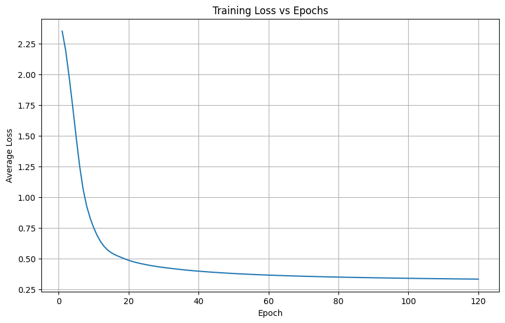

- **CNN:**
  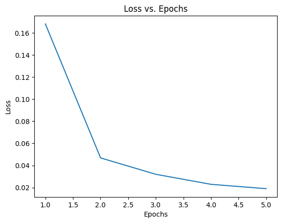

#### Confusion Matrix

- **MLP:**
  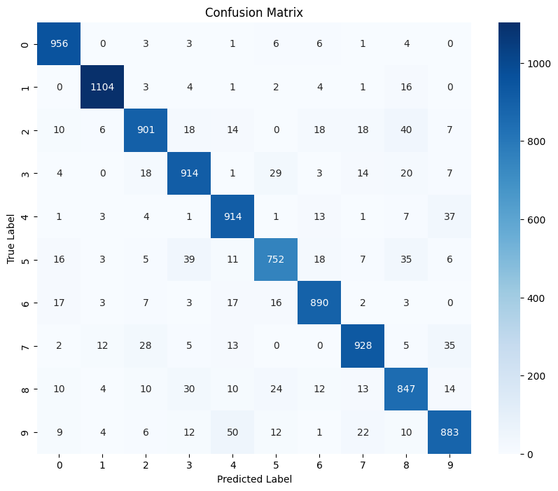

- **CNN:**
  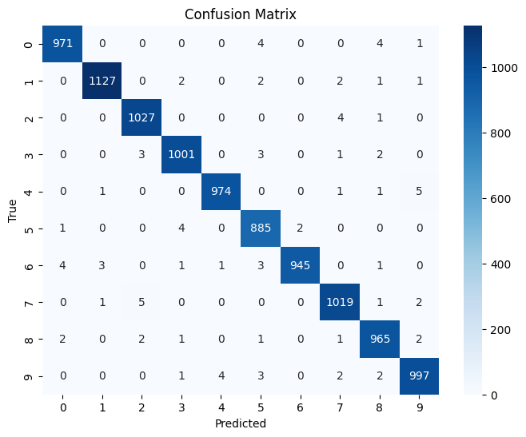

### Inferences

1. **MLP:**
   - Loss stabilized at 0.3313 over 120 epochs.
   - Accuracy improved but plateaued.

2. **CNN:**
   - Outperformed MLP in accuracy and convergence.
   - Lower misclassification rate due to feature extraction via convolution layers.

---
## Complete Code and Implementation

The complete implementation and code for this assignment can be found in the **[GitHub Repository](https://github.com/codesensei-tushar/Assignment-on-MLP-and-CNN.git)**.
