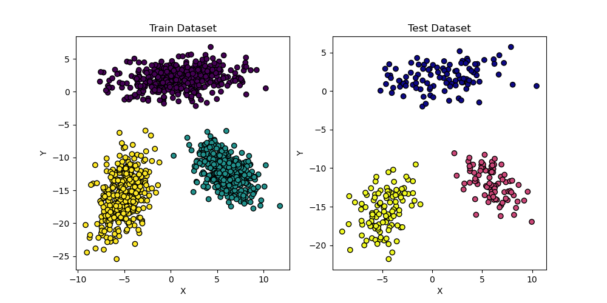
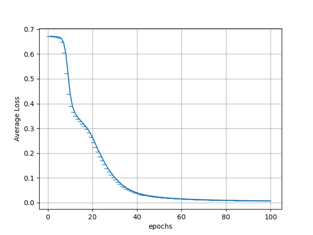
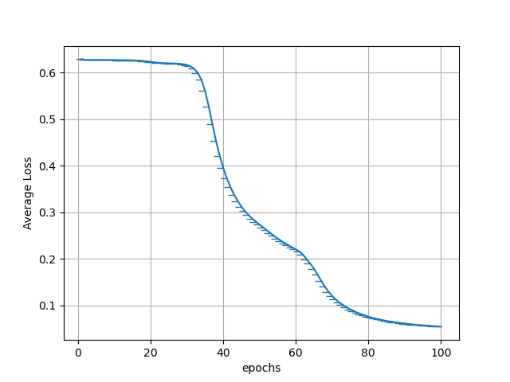
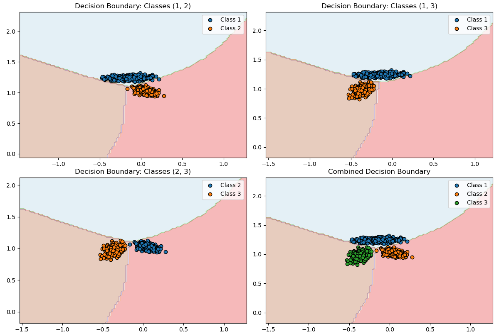
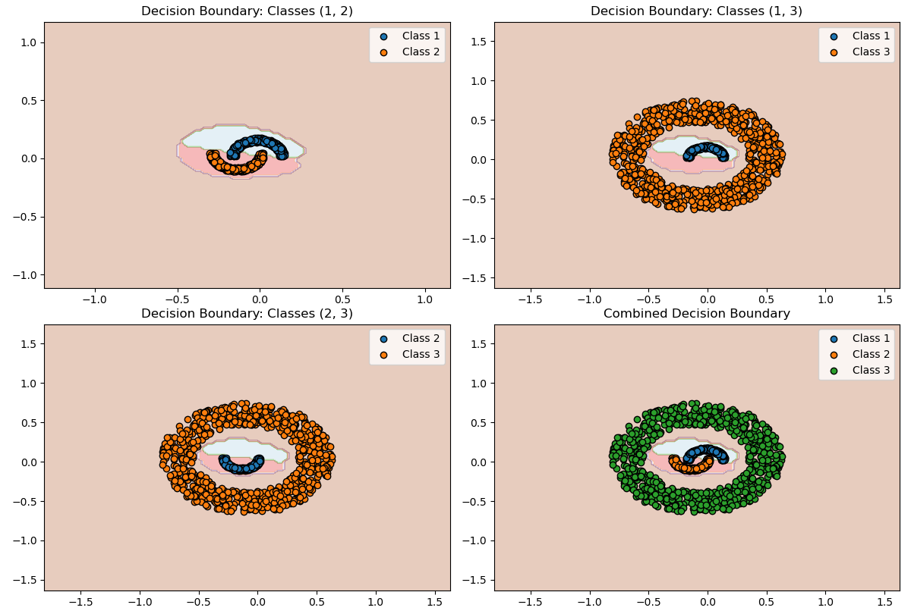
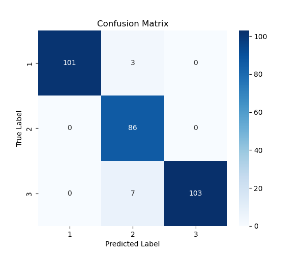
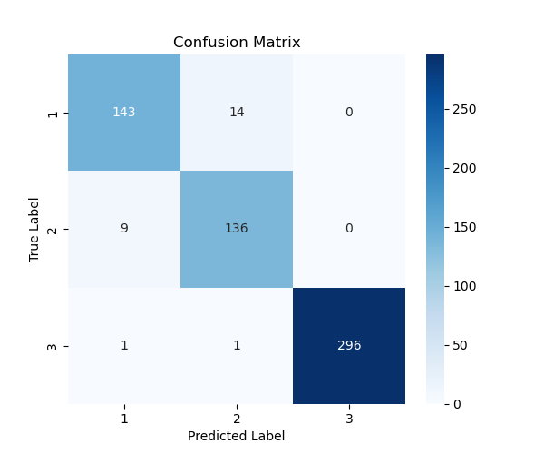

# CS671: Deep Learning and Applications  
## Assignment-1 Report  

---  

## PART-I : Classification Tasks  

### **Description**  
Described Perceptron model with a one-against-one approach for the given classification tasks and implemented the backpropagation algorithm from scratch for the perceptron learning algorithm.  

### **A visualization of train and test dataset for LS and NLS classes**  

#### **LS Dataset**  
  

#### **NLS Dataset**  
  

---  

### **Plot of Average Error vs Epochs on Train Data**  

#### **LS Dataset**  
  

#### **NLS Dataset**  
  

---  

### **Activation Function Used**  
- **MLP:** `sigmoid`, `softmax`

---  

### **Decision Region for Each Dataset**  

#### **LS Dataset**  
  

#### **NLS Dataset**  
  

---  

### **Confusion Matrix and Accuracy**  

#### **LS Dataset**  
  

#### **NLS Dataset**  
  

---  

### **Conclusion**  
- The dataset shows clear class separability in LS cases and overlapping regions in NLS cases.  
- The model shows a structured decision boundary, but some misclassifications occur, especially in NLS cases.  
- The accuracy suggests that the model is learning effectively but could be improved with better feature scaling or hyperparameter tuning.  

---  

## PART-II : Classification Tasks using Multi-Layer Perceptron  

### **Dataset Visualization**  
  

### **Network Architectures**  
- **MLP:** Fully connected layers with activation functions applied at each layer.  
- **CNN:** Convolutional layers followed by pooling layers and fully connected layers.  

### **Activation Functions and Loss Functions**  
- **MLP:** ReLU activation in hidden layers, Softmax in the output layer.  
- **CNN:** Convolutional layers use ReLU, and the final classification layer uses Softmax.  
- **Loss Function:** Cross-entropy loss is used for classification tasks.  

---  

### **Training Performance: Error vs. Epochs**  
  

### **Confusion Matrix and Classification Accuracy**  
  

---  

## **MLP Network Architecture**  

```python
import torch.nn as nn

class MLP(nn.Module):
    def __init__(self):
        super(MLP, self).__init__()
        self.fc1 = nn.Linear(784, 128)
        self.relu = nn.ReLU()
        self.fc2 = nn.Linear(128, 10)

    def forward(self, x):
        x = self.fc1(x)
        x = self.relu(x)
        x = self.fc2(x)
        return x
```

---  

### **Inferences from the Results**  
Yet to infer.  

---  
