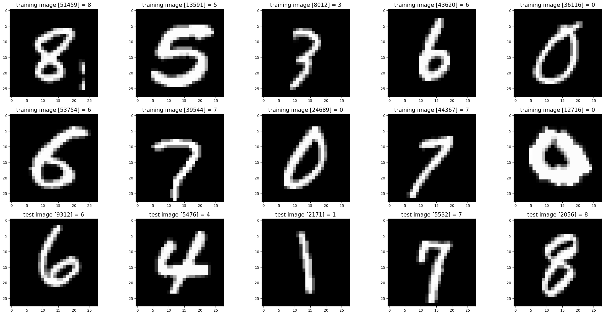
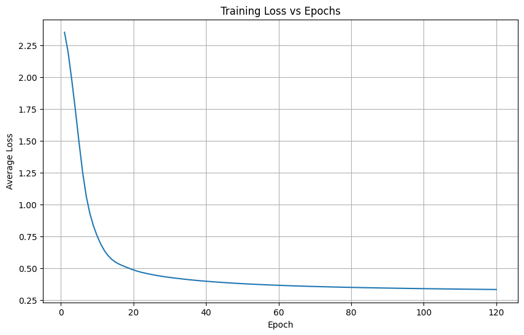
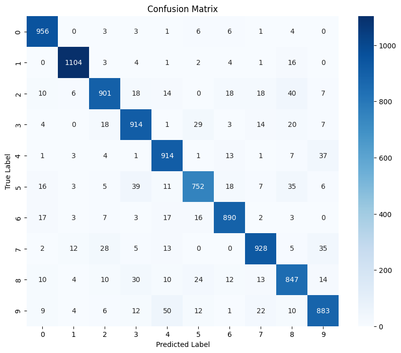
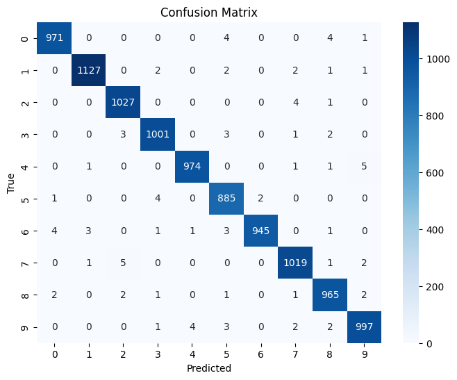

# CS671: Deep Learning and Applications
## Assignment-1 Report

## PART-I : Classification Tasks

### A visualization of train and test dataset for LS and NLS classes

Described Perceptron model with a one-against-one approach for the given classification tasks and implemented the backpropagation algorithm from scratch for perceptron learning.

### Visualization of Train and Test datasets for LS and NLS

    
     <b>Figure 1:</b> LS Dataset

    
     <b>Figure 2:</b> NLS Dataset

### Plot of average error (y-axis) vs epochs (x-axis) on train data

    
    
     <b>Figure 3:</b> Comparison of Average Error vs. Epochs for LS and NLS Datasets

### Activation Function Used
- MLP: `sigmoid`, or `softmax`

### Decision Region for Each Dataset

    
     <b>Figure 4:</b> Decision Region for LS Dataset

    
     <b>Figure 5:</b> Decision Region for NLS Dataset

### Confusion Matrix and Accuracy

    
    
     <b>Figure 6:</b> Comparison of Confusion Matrices for LS and NLS Datasets

### Conclusion
- The dataset shows clear class separability in LS cases and overlapping regions in NLS cases.
- The model shows a structured decision boundary, but some misclassifications occur, especially in NLS cases.
- The accuracy suggests that the model is learning effectively but could be improved with better feature scaling or hyperparameter tuning.

---

## PART-II : Classification Tasks using Multi-Layer Perceptron

### Dataset Visualization

    
     <b>Figure 7:</b> Sample images from the dataset

### Network Architectures
- **MLP:** Fully connected layers with activation functions applied at each layer.
- **CNN:** Convolutional layers followed by pooling layers and fully connected layers.

### Activation Functions and Loss Functions
- **MLP:** ReLU activation in hidden layers, Softmax in the output layer.
- **CNN:** Convolutional layers use ReLU, and the final classification layer uses Softmax.
- **Loss Function:** Cross-entropy loss is used for classification tasks.

### Training Performance: Error vs. Epochs

    
    
     <b>Figure 8:</b> Error vs. Epochs during Training for MLP and CNN

### Confusion Matrix and Classification Accuracy

    
    
     <b>Figure 9:</b> Confusion Matrices for MLP and CNN

### Inferences from the Results
1. MLP struggles with spatial features, while CNN captures hierarchical patterns, leading to better accuracy.
2. CNN converges faster due to efficient weight sharing, whereas MLP requires more epochs to learn effectively.
3. MLP overfits easily, while CNN generalizes better by learning translation-invariant features.

---

## Complete Code and Implementation

The complete implementation and code for this assignment can be found in the **[GitHub Repository](https://github.com/codesensei-tushar/Assignment-on-MLP-and-CNN.git)**.
